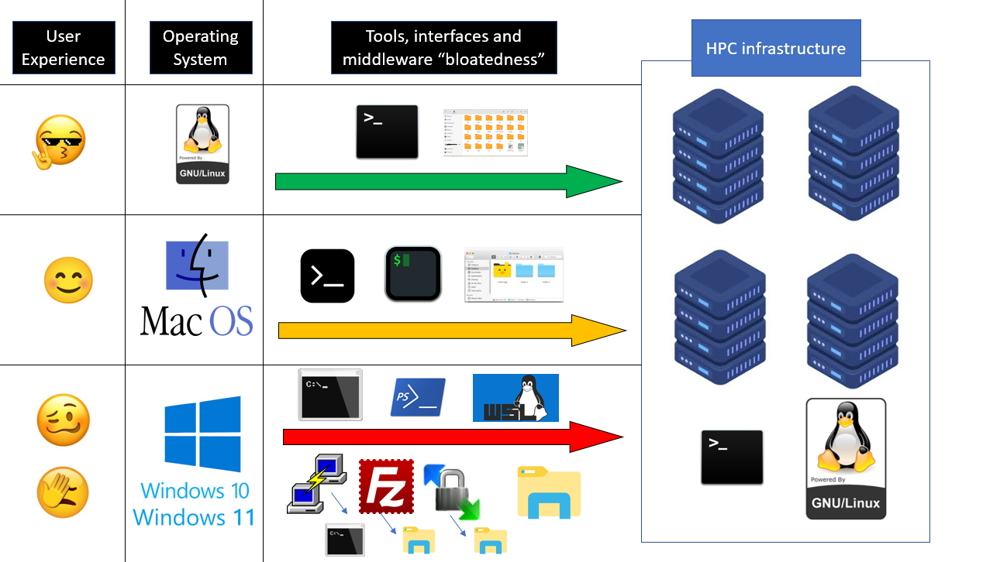

# HPC User experience (UX)

The following image sums up the average-user UX of HPC Services users.
due to the amount of involved toolchains, Apps and the complexity and multitude of middleware involved for each of the 3 cases.

Arrows are color-coded following a traffic light convention from the "easiest/best UX" green, to the "most frustrating/worst UX" red.

