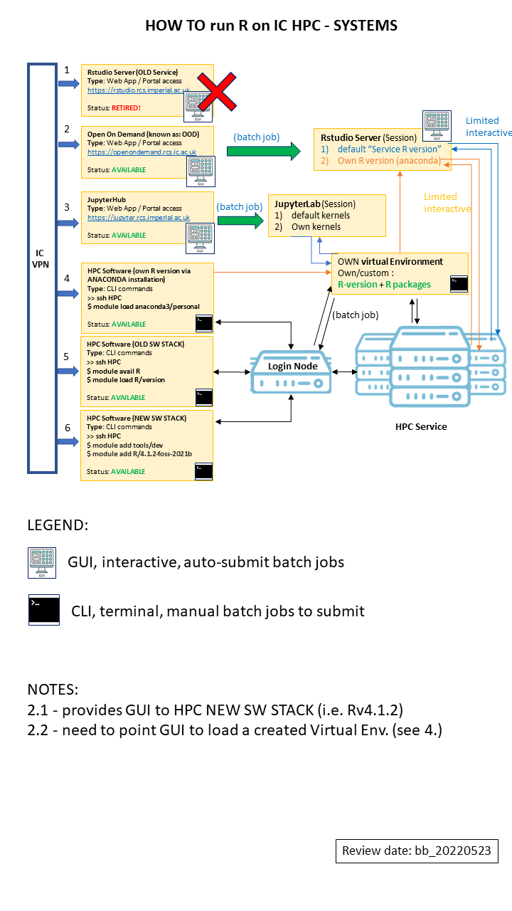
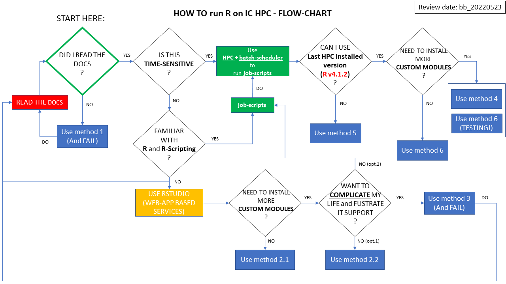

## IC RCS guide : How to run R on the HPC

### NOTES on RCS Rstudio Service

1. Should you wish to use **RStudio** you will need to use the **"New Service"**.

- The **OLD RStudio service** previously accessible via the link: https://rstudio.rcs.imperial.ac.uk has been retired and it is **no longer available**.  

- The **NEW RStudio Service** is accessible via  **OpenOnDemand (OOD)** [OOD Web Portal](https://openondemand.rcs.ic.ac.uk/) : Select `"Interactive Apps"` > `Rstudio Server`

2.  **OpenOnDemand (OOD)** connects to the Research Data Store system (RDS) (mounting the current HPC underlying filesystem).  
Any data saved there will still be available through the Web Portal itself and RStudio.

3. **RStudio** instances run within the context of PBS jobs (i.e. they are not standalone instances on a cloud infrastructure but real HPC jobs run on the cluster and as such, subjected to scheduling rules and pros/cons) and will be powered/limited by the following :

  - queue times, resources availability overall cluster usage/congestion.

4. custom **Anaconda environments** can be used within OOD RStudio.  
When selecting `Rstudio Server` options, the name of a custom conda environment can be specified.  
If the conda environment already exists in your HPC folders, then OOD RStudio will use that named one, otherwise the default R kernel from HPC apps will be used.

5. Any R packages you installed with the previous Rstudio will need to be re-installed (they are running different R versions).

---

To clarify the above please refer to the following images:

## How to run R / RStudio on IC HPC - systems

Use this picture as a reminder for Imperial College HPC Services systems whenever you want to run R; combine this with the flow chart below to select the most suitable way to run R on these systems.

## How to run R / RStudio on IC HPC - FLOW CHART

Use this flow-chart to guide your way through selecting the correct/available/most suitable method (from the above proposed ones) to run R on Imperial College HPC Service.

(resulting method numbers are referenced in the image above)  

