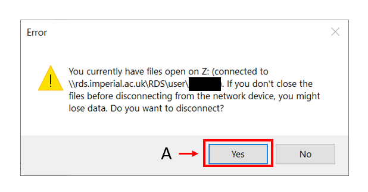

## MOUNTING RDS - Research Data Storage (AKA HPC-Storage) on Windows

In order to mount your remote RDS folders (home, ephemeral or project-folders..) on your local Windows computer like a network/remote drive

please refer to the instructions below.

- connect to IC VPN
- Open [Windows Explorer]  
- on side pane (right Click on) [Network icon]     
- [Map Network Drive]  

- **A** : pick an available Drive letter to mount  

- **B** : insert the path as specified below:  

  for "FULL-HPC-ACCESS users" -  `\\rds.imperial.ac.uk\rds\user\[username]\`  

  for "RDS-ONLY-ACCESS users" -  `\\rds.imperial.ac.uk\RDS\project\[project-name]`  

- **C** :  unflag/untick/deactivate the ``"Reconnect at sign-in"`` option.
  (this feature is normally useful and indicated for your local network drives but NOT for this RDS connection; in fact it's known to cause issues at reconnection especially if you change network, location, settings, hotspots or if server-side connections change for whatever reason.)

  **NOTE:**  
  it is advisable to NOT leave this option ON, but reconnect manually every time you need the service. (not ideal but this works best)

- **D** :  flag/tick/activate the  `"Connect using different credentials"` option.  

- **E** :  click the [Browse] Button.

if the `Browse For Folder` window (such as in the image below) does NOT appear, it means that you have client-side networking issues and that must be resolved first otherwise you cannot connect.

alternatively there could be server side issues that prevent you from connecting but in this case we would have notified users via broadcast email or using the Service Status portal.

**[ IC_VPN | Campus Network ]** --> https://selfservice.rcs.imperial.ac.uk/service-status

Refer to :  
[HPC Services main file](/README.md)  
[check HPC Services Status](/Service_Status.md)  

- **A** : expand the tree node `rds.imperial.ac.uk`  

- **B** : expand the tree node for the `RDS` folder  

- **C** : scroll down to find the `user` folder  

- **A** : expand the tree node of the `user` folder

- **B** : find your `username` folder

- **C** : click `OK`

- **F** : click `Finish`

- **A | B** :  specify the following info as your credentials :  

  USERNAME:   `IC\your_IC_username_here`  

  PASSWORD:   `*********` <--(your main IC account password HERE!)

- **C** : unflag/untick/deactivate the `Remember my credentials` option.  
  (this feature is normally useful and indicated for your local network drives but NOT for this RDS connection; in fact it's known to cause issues at reconnection especially if you change network, location, settings, hotspots or if server-side connections change for whatever reason.
  furthermore this also is known to cause issues due to password caching both locally and remotely)

  **NOTE:**  
  it is advisable to NOT leave this option ON, but reconnect manually every time you need the service. (not ideal but this works best)

#### NOTES:

please note that the attached video is quite old and the process may not be entirely correct there.

[TESTING /DRAFT]

test link01

bla bla

