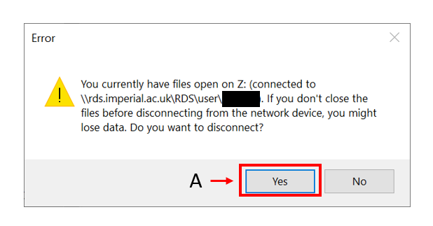

#### Access/mount RDS

Simple Video Tutorials on how to mount/access Research Computing - RDS Systems (Research Data Storage)
from various Client Operating Systems.

all credits to the original author: MJH.

test link01

bla bla

